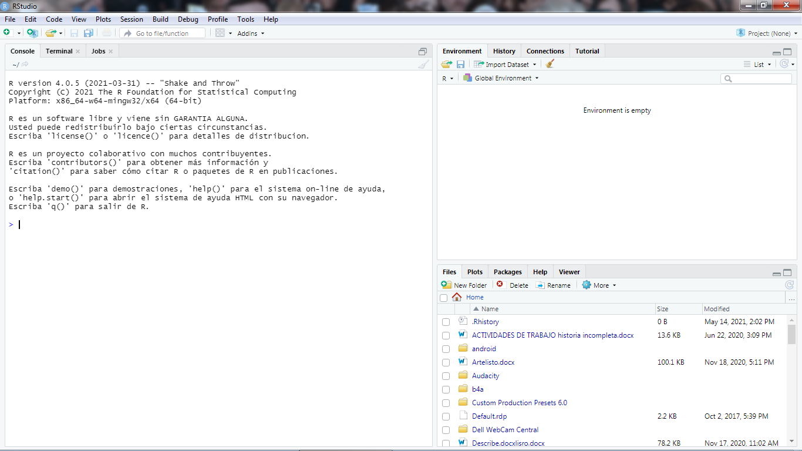
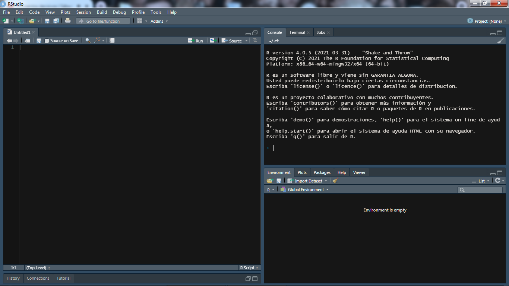
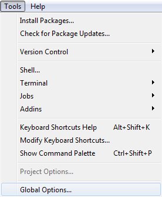
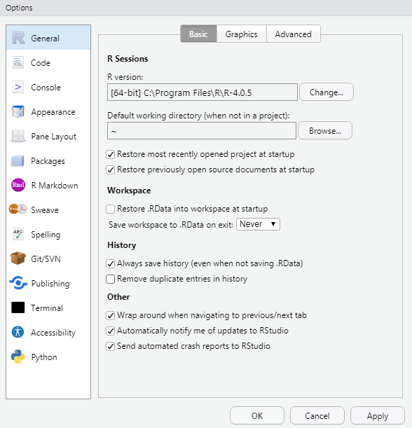
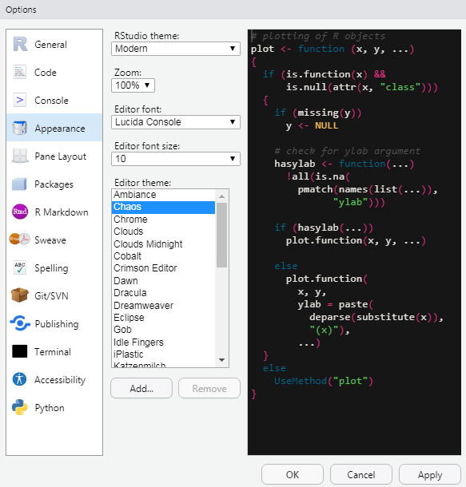
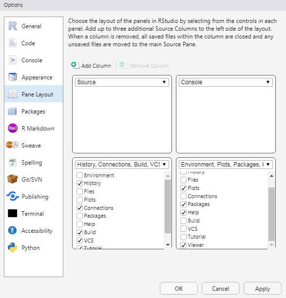
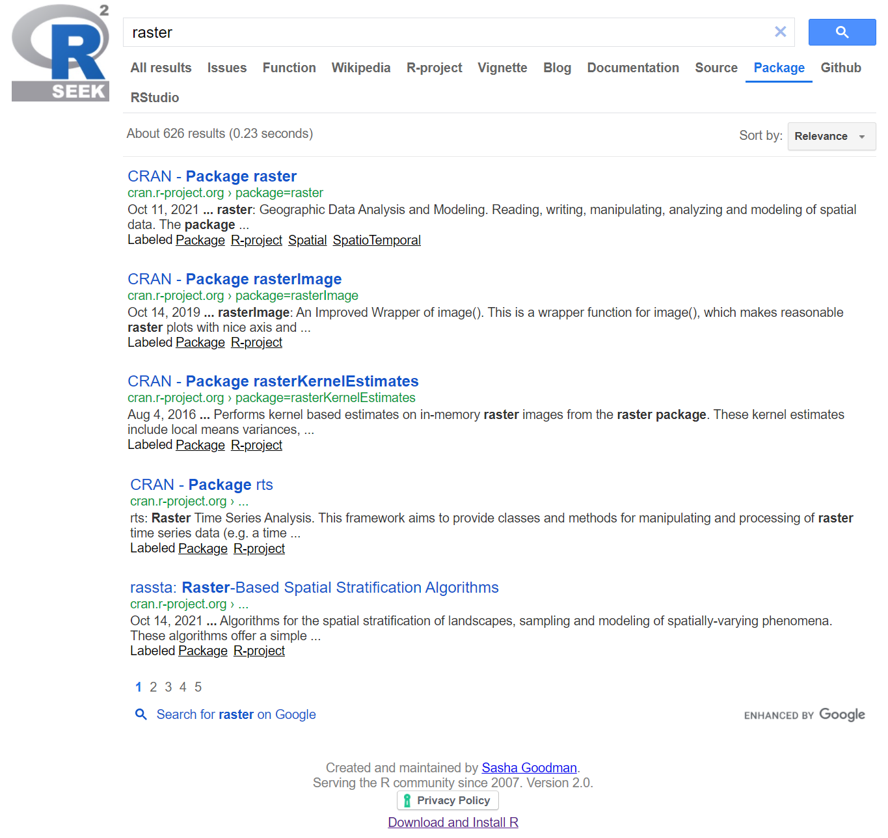
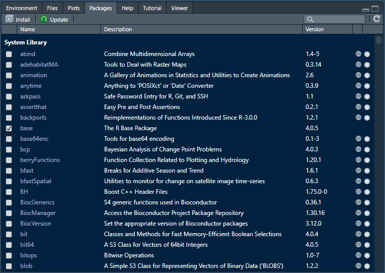
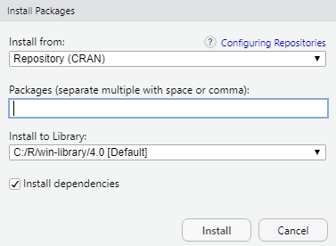
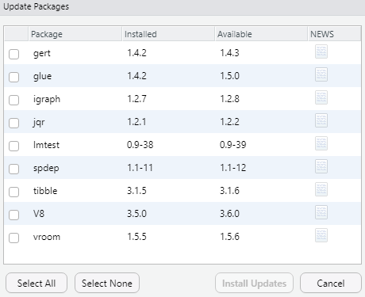

```{r setup, include=FALSE}
knitr::opts_chunk$set(echo = FALSE)
```

Nace como un dialecto de S, el cual es un lenguaje de programación desarrollado por _John Chambers_ (Figura \@ref(fig:img-crea-1)) y otros en la antigua "Bell Telephone Laboratorios", originalmente miembro de AT & T Corp. S se inicia en 1976 como un programa interno de análisis estadístico.


```{r img-crea-1, fig.cap="John Chambers creador de S.", fig.align='center'}
knitr::include_graphics("img/john-chambers.png")
```

En 1988 el sistema fue reescrito desde FORTRAN a C y empezó a parecerse al sistema que tenemos hoy en día (esto fue en la versión 3 del lenguaje S). Lo importante de destacar es el espíritu original por el cual fue diseñado el sistema: facilitar el análisis de datos, primero para ellos y eventualmente, para otros. 

John Chambers describe el anhelo al momento de diseñar el lenguaje S con que "los usuarios comenzaran en un entorno interactivo, donde no pensaran conscientemente en sí mismos como programadores. Entonces, cuando sus necesidades fuesen más claras y su sofisticación aumentara, deberían ser capaces de transitar gradualmente a la programación, cuando lenguaje y sistema serían más importantes". La clave fue la transición de usuario a desarrollador. Ellos querían construir un lenguaje que fácilmente podría dar servicio a ambos tipos de usuario. Técnicamente, necesitaban construir un lenguaje que fuese adecuado para el análisis de datos interactivo (basada en línea de comandos), así como para la escritura de programas (como los lenguajes tradicionales de programación).


```{r img-crea,fig.cap="Ross Ihaka y Robert Gentleman, los creadores de R.",fig.align='center', preview=T}
knitr::include_graphics("img/creators.jpg")
```

En 1991, Ross Ihaka y Robert Gentleman (Figura \@ref(fig:img-crea)) en el Departamento de Estadística de la Universidad de Auckland crean R. Inspirado en la filosofía de S pero como un proyecto totalmente abierto. En 1993, se hace público. La experiencia de Robert y Ross sobre el desarrollo de R está documentada en un interesante artículo de 1996 en el Journal of Computational and Graphical Statistics [@Ihaka1996].

Hoy R se ejecuta en casi cualquier sistema operativo o plataforma informática estándar ¡incluso en una playstation 3! Una característica interesante en muchos proyectos de código abierto son las versiones frecuentes. Estos días se produce una liberación anual importante, por lo general en octubre, donde se incorporan nuevas características principales y lanzadas al público. A lo largo del año, se realizarán lanzamientos de corrección de errores en pequeña escala, según sea necesario. Los lanzamientos frecuentes y ciclo de liberación regular indican un permanente y activo desarrollo del software donde se asegura que los errores serán tratados de una manera oportuna. Por supuesto, el árbol principal de código fuente de R se encuentra bajo el control de un pequeño grupo de desarrolladores. Al momento de escribir estas líneas (mayo 2021) nos encontramos en la versión 4.0.5 o **Shake and Throw**. 

Es interesante notar el dato anecdótico que los nombres propios con que se han designado desde la primera versión liberada *Great Pumpkin* (versión 2.14.0, noviembre 2011) o *Trick or Treat* (versión 2.15.2, octubre 2012) entre muchas otras  hacen referencia a un capítulo específico de la serie animada \index{Peanuts}*Peanuts* (Figura \@ref(fig:img-pea)). 


```{r img-pea, fig.cap="Serie animada Peanuts (Snoopy) basada en los comics de Charles Schulz.", fig.align='center'}
knitr::include_graphics("img/Peanuts2014.jpg")
```

Otra de las ventajas clave que R posee avanzadas capacidades gráficas con *calidad de publicación* cuya existencia se ha asegurado desde el principio del proyecto mediante el control muy fino en todos los aspectos de la composición gráfica.

## Diseño de la Plataforma R {#dis-plat}

El éxito alcanzado por el proyecto R no tiene nada que ver con las herramientas en sí mismas, sino más bien con lo activa que sea la comunidad de usuarios, hoy miles de ellos en todo el mundo se han unido para realizar contribuciones como también ayudar a otros a usar R para todo tipo de nuevas e insospechadas aplicaciones.

El sistema \index{R base}R base o core o núcleo de la plataforma se compone de las herramientas mínimas para su funcionamiento que se encuentra disponible para varios sistemas operativos: Linux, Windows, Mac e incluso su Código Fuente en la denominada *Red Exhaustiva de Archivos R* (\index{Comprehensive R Archive Network}Comprehensive R Archive Network, \index{CRAN}CRAN. [cran.r-project.org](https://cran.r-project.org/), es una red de servidores ftp y web en todo el mundo que almacenan versiones idénticas y actualizadas de código y documentación para R)

[^1.3]: [www.bioconductor.org](https://www.bioconductor.org/)


## \index{RStudio}RStudio {#rstudio}

Aunque R posee un diseño muy avanzado e inteligente a medida que se realizan rutinas para análisis de datos, gráficos, o se generan archivos temporales de esos mismos procesos o se descargan e instalan diversos paquetes de código adicionales se hace muy difícil de mantener y menos aún generar procedimientos claros, organizados y replicables en distintos entornos informáticos, siendo esta última capacidad crítica para la aproximación científica al análisis de datos. RStudio también es una herramienta libre que hace más fácil el trabajo con R, @Loo2012 definen sus principales características como:  

- Editor de texto, explorador de archivos, visualizador de gráficos todo en el mismo entorno.  
- Trabaja directo con una instalación subyacente de R.  
- Organiza el código y mantiene múltiples proyectos.  
- Mantiene mi investigación reproducible.  
- Mantiene los paquetes en la instalación de R.  
- Crea y comparte reportes.  
- Comparte el código y colabora con otros usuarios.  

RStudio hoy es una aplicación y una fundación dedicada al soporte de sus productos de código abierto [^1.4] como al servicio comercial de capacitación y consultoría en temas estadísticos y R. Su fundador \index{J.J. Allaire}J.J. Allaire también inventa el lenguaje de programación web *ColdFusion*, *Windows Live Writer* (programa para escribir y publicar blog), *FitNow* y *LoseIt* ambas aplicaciones móviles para ejercicio y pérdida de peso entre otros proyectos tecnológicos.

[^1.4]: [www.rstudio.com](https://www.rstudio.com/)

## Características Principales {#car-prin}

Algunas propiedades que hacen de RStudio el editor ideal para trabajar con R (tomado de @Loo2012):  
___Integración con la consola R:___ Escribe comandos directamente en R dentro de RStudio.  
___Ejecución de código:___ Ejecuta código directo desde el editor.    
___Paréntesis inteligente:___	Cierre automático de paréntesis, ilumina selección, cierre de comillas automático. Termina de escribir la palabra previamente iluminada de un menú \index{intellisense}intellisense.  
___Ayuda en línea:___ Acceso directo a la ayuda de lenguaje y sintaxis.  
___Atajos de teclado:___ Tareas repetitivas son asociadas a combinación de teclas. Integra Ayuda, Permite navegar y buscar en las páginas de ayuda nativas de R.  
___Explorador de objetos e Historia:___ Se puede inspeccionar cada objeto creado en la sesión actual de R y su explorador de historia permite recorrer los comandos utilizados desde el actual hasta el primero de la sesión.  
___Navegar por el código:___ Saltar entre funciones, llamadas y reportes, visor de datos y visualización tipo grilla para explorar el contenido de los objetos en la sesión actual.  
___Menús de Importar datos:___ Para los tipos más comunes de archivo, ofrece un sistema de menú que genera el código R necesario. Integración gráfica con zoom, paneo y capacidades de exportación.  
___Gestión de proyectos:___ Facilita el manejo y control de varios proyectos. Control de versión e integra los sistemas de control git y svn.  
___Generación de Documentos:___ Genera pdf, html y otros formatos de reporte usando \index{RMarkdown}RMarkdown, \index{Sweave}Sweave o \index{knitr}knitr.   
___Publicación:___ Publicar reportes y rutinas directo a la web de _\index{Rpubs.com}Rpubs.com._  

## Instalación de Plataforma R y RStudio {#inst-pla}

Primero se debe descargar el paquete de instalación desde el sitio web [www.r-project.org](https://www.r-project.org/) siguiendo el link __CRAN__ y buscar en el listado de servidores espejo el más cercano a la ubicación del usuario.  Luego, seleccionar la versión correspondiente al sistema operativo de la máquina a instalar.  A continuación, prestar atención y ubicar el link __install R for the first time__ en el apartado _base_.  

Finalmente, encontramos el link para la descarga del paquete instalador, siempre será le versión más reciente. Ejecutar el programa y seguir los pasos indicados por el asistente.[^1.5]  

[^1.5]: Es importante señalar que el _nombre de usuario_ de la sesión Windows donde se realizará la instalación  __no existan__ espacios e idealmente no contenga tildes. De ser así, es recomendable crear una nueva sesión con un nombre sin espacios ni tildes.  

Una vez terminada la instalación de R procedemos a instalar el programa RStudio desde el sitio [www.rstudio.com](https://www.rstudio.com) y buscar en la lista de productos _RStudio Desktop._ A continuación, seleccionar la versión _Open Source Edition_ que es libre de pago. Finalmente seguir la secuencia de botones correspondiente hasta llegar al punto de descarga del paquete de instalación.  Poner especial atención en seleccionar el que corresponda a su versión de sistema operativo.  Ejecutar el programa y seguir los pasos indicados por el asistente.

## Consideraciones Preliminares {#con-pre}

El entorno de trabajo de RStudio posee una configuración por defecto que presenta una distribución de funcionalidades orientada al uso como entorno interactivo de cálculo y proceso de datos mediante línea de comandos contenido en la ventana _\index{Panel Console}Console_ y una vista general de los objetos y variables creadas en la sesión actual en la ventana \index{Panel Environment}_Environment_ (Figura \@ref(fig:img-gui)).  

```{r img-gui,fig.cap="Configuración por defecto.", fig.align='center'}

```


El tipo de trabajo descrito en el presente texto utiliza metodologías más complejas y extensas que trabajar solo como calculadora o proceso de datos. Por lo tanto, vamos a sugerir una nueva distribución de ventanas que optimicen el trabajo en un tipo de archivos que permiten ir escribiendo largas secuencias de comandos que van desarrollando las tareas de manera secuencial y por seguridad buscamos grabar en disco un archivo que la próxima vez me permita repetir dicha secuencia y continuar o modificar según el caso. Los archivos creados tendrán la extensión _.R_ y los denominaremos _\index{scripts}scripts_.  

Una mejor disposición de ventanas es la sugerida en la figura \@ref(fig:img-gui-1). Donde se privilegia el panel izquierdo para extender a altura completa el editor de texto y maximizar el área disponible para escribir y editar scripts y mantiene el panel derecho la consola con su línea de comando.  

```{r img-gui-1, fig.cap="Configuración sugerida.", fig.align='center'}

```


Otro aspecto importante es el uso de un color de fondo obscuro que reduce la fatiga visual cuando se sienta frente al monitor durante períodos muy prolongados.  

Otra característica configurada por defecto es que al momento de salir de una sesión, es guardar el _espacio de trabajo_ lo que significa que se crea una imagen de las variables y funciones actuales en un archivo llamado \index{.RData}”.RData”.  

Cuando se vuelve a abrir R desde el mismo directorio de trabajo, el espacio de trabajo se cargará y todas estas cosas estarán disponibles. Pero no recomendamos ese comportamiento. Cargar un espacio de trabajo guardado convierte el script cuidadosamente escrito donde todo sucede lógicamente de acuerdo con un plan a algo parecido a un cajón de sastre, lleno de páginas y cuadernos variados que pueden ser o no pertenecientes al trabajo actual.  

Para configurar nuestro programa recomendamos cambiar algunos parámetros en la configuración general de la aplicación, para ellos debemos ir a la opción de menú ___Tools/Global Options___. (Figura \@ref(fig:img-gui-2)).  

```{r img-gui-2, fig.cap="Opción de menú para configuración general.", fig.align='center'}

```

El cuadro de dialogo resume un gran número de parámetros que abarcan detalles del funcionamiento general de RStudio (Figura \@ref(fig:img-gui-op-1)).  

```{r img-gui-op-1, fig.cap="Panel de configuración general.", fig.align='center'}

```

Los siguientes cambios son necesarios para configurar los aspectos mencionados en punto anterior:  

- _General:_ Para quitar la carga automática de variables y funciones de la última sesión, debemos en el grupo __Workspace__ quitar el check de _Restore .RData into..._ y seleccionar la opción ___Never___ de la lista _Save workspce to .RData..._ (Figura \@ref(fig:img-gui-op-1)). 
- _Appearance:_ La configuración de colores en el editor de texto y los otros cuadros se selecciona en la lista _Editor theme:_ y se debe tener especial cuidado en elegir aquel con un fondo negro o muy obscuro (Figura \@ref(fig:img-gui-op-2)). 
- _Pane Layout:_ La distribución de los espacios disponibles para optimizar el editor de texto y mantener la línea de comando visible se configura siguiendo las opciones en indicadas en la figura \@ref(fig:img-gui-op-3)).

```{r img-gui-op-2, fig.cap="Selección para configuración de colores.",fig.align='center'}

```
```{r img-gui-op-3,fig.cap="Configuración de paneles y cuadros.", fig.align='center'}

```

# \index{paquete}Paquetes {#intro-package}

El sistema base, tal como se describe en \ref{dis-plat}, es capaz de ejecutar rutinas y código encapsulado en forma de módulos o paquetes \index{packages}(*packages*) que amplifican y diversifican las posibilidades de cómputo, gráfica, conexiones remotas, generación de documentos y un gran, gran etc. 

> El __sistema base o core__ también se forma de un conjunto de paquetes.  


Además de las funciones más fundamentales el sistema base incluye los paquetes
\index{paquete!utils}utils, \index{paquete!stats}stats, \index{paquete!datasets}datasets, \index{paquete!graphics}graphics, \index{paquete!grDevices}grDevices, \index{paquete!grid}grid, \index{paquete!methods}methods, \index{paquete!tools}tools, \index{paquete!parallel}parallel, \index{paquete!compiler}compiler, \index{paquete!splines}splines, \index{paquete!tcltk}tcltk, \index{paquete!stats4}stats4 y algunos paquetes *recomendados*: \index{paquete!boot}boot, \index{paquete!class}class, \index{paquete!cluster}cluster, \index{paquete!codetools}codetools, \index{paquete!foreign}foreign, \index{paquete!KernSmooth}KernSmooth, \index{paquete!lattice}lattice, \index{paquete!mgcv}mgcv, \index{paquete!nlme}nlme, \index{paquete!rpart}rpart, \index{paquete!survival}survival, \index{paquete!MASS}MASS, \index{paquete!spatial}spatial, \index{paquete!nnet}nnet, \index{paquete!Matrix}Matrix. 

Cuando se descarga una instalación nueva de R desde CRAN, se obtiene todos los paquetes mencionados, que representa un gran porcentaje de la funcionalidad del sistema. 

## Búsqueda {#pack-search}

Además de la gran cantidad de paquetes instalados por defecto, existe una gran cantidad de paquetes opcionales disponibles.  

- A noviembre 2021 existen 18.407 paquetes en CRAN que han sido desarrollados por los usuarios y programadores alrededor del mundo cada uno de ellos diseñado para un campo en especial.
- También hay muchos paquetes asociados con el proyecto \index{Bioconductor}**Bioconductor**[^1.3], (detalles en \ref{bioconductor}). 
- Las personas a menudo hacen sus propios paquetes y los hacen disponibles en sus sitios web personales; en realidad no hay manera confiable de realizar un seguimiento de cuántos paquetes están disponibles de este modo.
- Hay una serie de paquetes que se desarrollan en los repositorios de GitHub y BitBucket pero no existe ninguna lista fiable de todos estos paquetes.  

El mejor método para buscar en la web, nuevos paquetes es utilizar el sitio [rseek.org](https://rseek.org/) (Figura \@ref(fig:img-pack-3)) usando palabras claves y potenciado por el motor de búsqueda de Google. 

```{r img-pack-3, fig.cap="Sitio web de búsqueda de contenido asociado a R, modo 'Package'.", fig.align='center'}

```

Generalmente los resultados siempre serán múltiples y variados. 


## Instalación {#pack-install}

Una vez identificado un paquete que ofrece las funcionalidades deseadas se debe instalar en nuestro ambiente R y dejarlo disponible para cuando se necesite. El entorno RStudio cuenta con un panel específico (Figura \@ref(fig:img-pack-1)). 

```{r img-pack-1,fig.cap="Panel Packages.", fig.align='center'}

```

Que junto al listado de paquetes ya instalados se dispone de opciones para instalar ___Install___ y ___Update___ o actualizar los existentes.  

### Cuadro Diálogo {#pack-cuadro}

El botón __Install__ levanta un cuadro de diálogo con las opciones de configuración (Figura \@ref(fig:img-pack-4)) para instalar paquetes disponibles en CRAN o los paquetes descargados en formato _.zip_ de sitios no oficiales. 


```{r img-pack-4, fig.cap="Opciones de Instalación vía RStudio.", fig.align='center'}

```

### Función _install.packages()_ {#pack-install-code}

Un segundo método de instalación es utilizar la función R escrita directamente en la consola y reemplazando _nombre_ por el paquete deseado. 

\index{install.packages()}  
```{r eval=FALSE, include=TRUE}
install.packages("nombre")
```

## Actualización {#pack-update}

El botón ___Update___ del panel paquetes levanta el cuadro de diálogo diseñado para la selección de los paquetes a actualizar. La lista solo muestra aquellos disponibles de actualización (Figura \@ref(fig:img-pack-5)). 

```{r img-pack-5,fig.cap="Opciones de Instalación vía RStudio.", fig.align='center'}

```

Hasta acá la descripción inicial introductoria a la plataforma RStudio. Te invito a comentar y compartir en tus redes para ampliar el número de felices usuarios de R.

Un saludo cordial, Danilo. 
